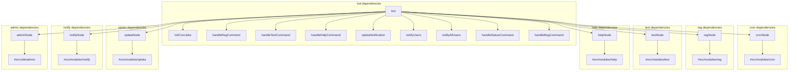

```mermaid
graph TD
    bot --> cronNode
    bot --> regNode
    bot --> textNode
    bot --> helpNode
    bot --> oplataNode
    bot --> notifyNode
    bot --> adminNode

    subgraph botDeps["bot dependencies"]
        bot --> initCronJobs[initCronJobs]
        bot --> handleRegComment[handleRegComment]
        bot --> handleTextCommand[handleTextCommand]
        bot --> handleHelpCommand[handleHelpCommand]
        bot --> oplataNotification[oplataNotification]
        bot --> notifyUsers[notifyUsers]
        bot --> notifyAllUsers[notifyAllUsers]
        bot --> handleStatusCommand[handleStatusCommand]
        bot --> handleMsgCommand[handleMsgCommand]
    end

    subgraph cronDeps["cron dependencies"]
        cronNode --> cronModule["#src/modules/cron"]
    end

    subgraph regDeps["reg dependencies"]
        regNode --> regModule["#src/modules/reg"]
    end

    subgraph textDeps["text dependencies"]
        textNode --> textModule["#src/modules/text"]
    end

    subgraph helpDeps["help dependencies"]
        helpNode --> helpModule["#src/modules/help"]
    end

    subgraph oplataDeps["oplata dependencies"]
        oplataNode --> oplataModule["#src/modules/oplata"]
    end

    subgraph notifyDeps["notify dependencies"]
        notifyNode --> notifyModule["#src/modules/notify"]
    end

    subgraph adminDeps["admin dependencies"]
        adminNode --> adminUtil["#src/utils/admin"]
    end

```