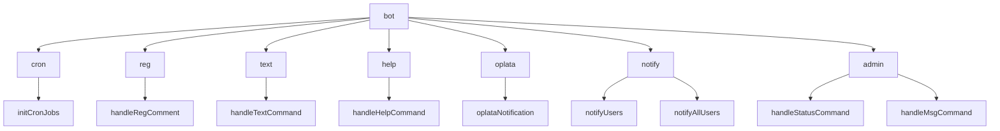

```mermaid
graph TD
    bot --> cron
    bot --> reg
    bot --> text
    bot --> help
    bot --> oplata
    bot --> notify
    bot --> admin

    cron --> initCronJobs[initCronJobs]

    reg --> handleRegComment[handleRegComment]

    text --> handleTextCommand[handleTextCommand]

    help --> handleHelpCommand[handleHelpCommand]

    oplata --> oplataNotification[oplataNotification]

    notify --> notifyUsers[notifyUsers]
    notify --> notifyAllUsers[notifyAllUsers]

    admin --> handleStatusCommand[handleStatusCommand]
    admin --> handleMsgCommand[handleMsgCommand]
```